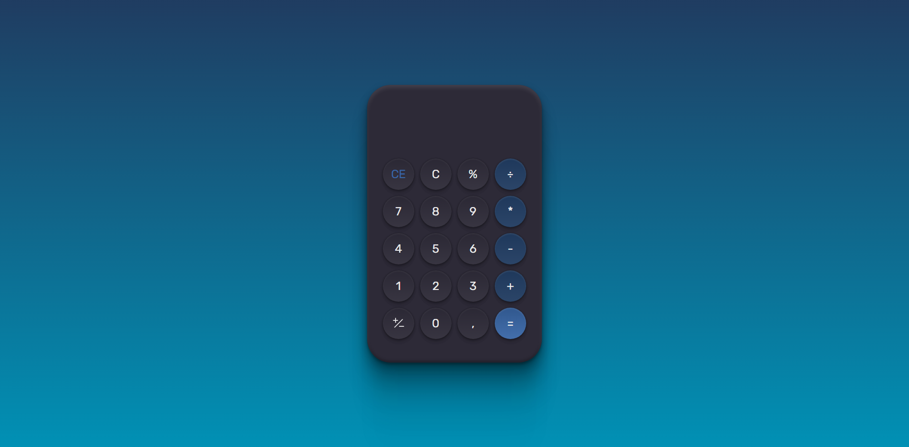

<h1 align="center"> Calculadora </h1>

Primeiro código de uma calculadora em javascript, com CSS usado do desafio #boraCodar da Rocketseat e ajustado ao meu gosto.  

  <a href="#-tecnologias">Tecnologias</a>&nbsp;&nbsp;&nbsp;|&nbsp;&nbsp;&nbsp;
  <a href="#-projeto">Projeto</a>&nbsp;&nbsp;&nbsp;|&nbsp;&nbsp;&nbsp;
  <a href="#memo-licença">Licença</a>

  

 

  

## 🚀 Tecnologias

Esse projeto foi desenvolvido com as seguintes tecnologias:

- HTML e CSS
- JavaScript
- Git e Github
- Figma

## 💻 Projeto

A Calculadora faz operações básicas, com um botão "%", que mostra o resto de uma divisão.

- [Visite o projeto online](https://fmtgomes.github.io/Calculator/)

## :memo: Licença

Esse projeto está sob a licença MIT.
